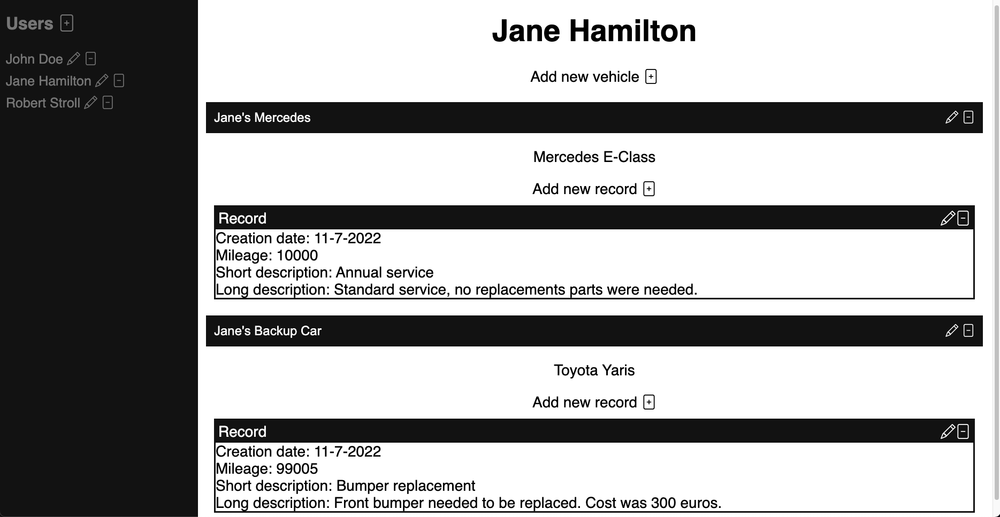
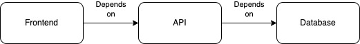
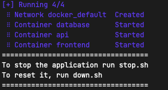

# Car Maintenance Tracker

Car Maintenance Tracker (CMT) is a web application that allows to track expenses or events in a vehicle fleet. 



## Software stack

The whole application is divided into 3 Docker containers:

- Database - Postgres database that is inaccessible outside of the container network
- API - Java application, created using Spring, that exposes CRUD operations via HTTP protocol. The application is hosted on a tomcat server located inside of this container
- Frontend - A simple server created in Node.js that hosts HTML, CSS and JS files



## Requirements

After cloning the repository make sure that you have following applications installed:

- Docker
- JDK 11 or higher
- Apache Maven
- (Preferably) Unix based system

## How to run/stop

Application comes with 3 .sh files that will do all the hard work for you, they are named after docker compose commands:

- up.sh - Builds docker containers and starts them up
- stop.sh - Stops docker containers but does not delete their data
- down.sh - Stops docker containers, removes them and their data

They can be ran like this from the project's root directory:

```
sh up.sh
```



Additionally there is also a file called *tests.sh* that will set up the testing environment and run tests for API application. It is not recommended to run it if up.sh has been called without stop.sh or down.sh afterwards.

**Warning: Those scripts were designed for UNIX systems, I can't guarantee that they will behave in the same way on Windows system. In this case if you are familiar with docker the information that docker-compose.yml is located inside of "docker" directory should be enough for you to figure out the rest.**

## How to access

Once started up, you can access the simple frontend at port 80 from your browser:

http://localhost:80

API endpoints are also available under:

http://localhost:8008/cmt-api/

## API endpoints

### API exposes the access to database using following URLs (on port 8008):

| Endpoint | Description | Method | Parameter
| :--- | :--- | :--- | :--- 
| `/cmt-api/users` | Access users | `GET, POST, PUT, DELETE` | N/A
| `/cmt-api/users/{id}` | Access user | `GET` | ID number matching the one from the database
| `/cmt-api/vehicles` | Access vehicles | `GET, POST, PUT, DELETE` | N/A
| `/cmt-api/vehicles/{id}` | Access vehicle | `GET` | ID number matching the one from the database
| `/cmt-api/records` | Access records | `GET, POST, PUT, DELETE` | N/A
| `/cmt-api/records/{id}` | Access record | `GET` | ID number matching the one from the database

<br/>

### Successful HTTP codes for each method

| Method | Valid code
| :--- | :--- 
`GET` | 200 (OK)
`POST` | 201 (CREATED)
`PUT` | 200 (OK)
`DELETE` | 204 (NO CONTENT)

Example of successful response from GET request on `/cmt-api/users` endpoint

```
[
    {
        "id": 1,
        "userName": "Jan Kowalski"
    },
    {
        "id": 2,
        "userName": "Jonh Doe"
    },
    {
        "id": 3,
        "userName": "Anna Nowak"
    }
]
```

All responses are POJOs (Plain Java objects) converted into JSON.
You can see them in *CMT API/src/main/java/com/n3lx/model* directory.

### Unsuccessful HTTP codes

| Code | Description
| :--- | :--- 
`500` | INTERNAL SERVER ERROR
`400` | BAD REQUEST

Those codes can be thrown by API if an exception has occured. Currently there are two types of exceptions:

- InputValidationException
- CustomSQLException

Both exceptions will be translated to API response and throw one of predefined error messages.  
In case of CustomSQLException if no such message is found, it will throw raw SQL error that was received from database.

Example error response:
```
{
    "message": "ERROR: insert or update on table \"records\" violates foreign key constraint \"records_vehicle_id_fkey\"\n  Detail: Key (vehicle_id)=(1) is not present in table \"vehicles\".",
    "timestamp": "2022-07-11T18:19:45.320139381"
}
```

Keep in mind that if your JSON is invalid in your request body then you may encounter a standard Bad Request page from Apache Tomcat as opposed to API response.